# 🌳 Family Tree


[](LICENSE)


<!-- If you adopt GitHub Actions, replace repo and workflow names below -->
[](https://github.com/r39132/family-tree/actions/workflows/ci-cd.yml)

A full‑stack repo for a **Family Tree** website you can run locally or deploy on **Google Cloud**.

- **Frontend:** Next.js (TypeScript), nature‑themed UI, pages for Login, Register (with invite code), Forgot Password, Reset Password, Tree view with CRUD and move
- **Backend:** FastAPI (Python 3.12.3), Firestore (named DB supported), JWT auth, email reset flow (SMTP or console)
- **Quality:** uv, ruff (lint/format), black config, pytest + coverage, pre-commit
- **Deploy:** Dockerfile + GitHub Actions CI/CD to Cloud Run

## Quick Start (Local)

### Prereqs
- Node 18+ and npm
- Python 3.12.3 (project pinned via `.python-version`)
- `uv` package manager (https://docs.astral.sh/uv/)
- `gcloud` SDK (if deploying or testing Firestore access locally with ADC/SA)
- Firestore database already created (named or (default))

### Configure env

Create `backend/.env` (see `backend/.env.example`) and `frontend/.env.local` (see `frontend/.env.local.example`).

For local development with a service account:
```bash
export GOOGLE_APPLICATION_CREDENTIALS=/path/to/sa.json
export GOOGLE_CLOUD_PROJECT=your-project-id
export FIRESTORE_DATABASE=family-tree   # your DB id; omit or set to (default) if using the default
```

### Python env setup (uv venv)

This project uses uv-managed virtual environments. To create/sync the backend env:

```bash
cd backend
uv venv --python 3.12.3   # create a .venv with Python 3.12.3
uv sync                   # install project deps into .venv
```

Activate the venv (macOS bash):

```bash
source .venv/bin/activate
```

You can also run commands without activating by prefixing with `uv run`:

```bash
uv run python -V
uv run pytest
uv run uvicorn app.main:app --host 0.0.0.0 --port 8080 --reload
```

To upgrade/switch Python, update `.python-version` (root and backend) and recreate the venv:

```bash
rm -rf backend/.venv
uv venv --python 3.12.3
uv sync
```

### Git hooks (pre-commit / pre-push)

This repo uses pre-commit for formatting/linting and a pre-push test check:

- pre-commit: ruff (with --fix), ruff-format, black, end-of-file-fixer, trailing-whitespace
- pre-push: run backend pytest via uv

Install and activate hooks:

```bash
cd backend
uv run pre-commit install            # install pre-commit (pre-commit hooks)
uv run pre-commit install --hook-type pre-push  # also install pre-push

# optional: run on all files once
uv run pre-commit run --all-files
```

### Run locally

```bash
# Backend
cd backend
uv run uvicorn app.main:app --host 0.0.0.0 --port 8080 --reload

# Frontend (in another terminal)
cd ../frontend
npm install
npm run dev
```
Frontend default: http://localhost:3000 (proxying calls to `http://localhost:8080`)

### Docker Compose (optional)

```bash
docker compose up --build
```

## CI/CD to Cloud Run

- Build & test on push
- Build container and deploy to Cloud Run (backend only) when pushing to `main`

### Required GitHub Secrets

- `GCP_PROJECT_ID`
- `GAR_LOCATION` (e.g., `us-central1`)
- `CLOUD_RUN_REGION` (e.g., `us-central1`)
- `CLOUD_RUN_SERVICE` (e.g., `family-tree-api`)
- `GCP_SA_KEY` – JSON key for a deployer service account with:
  - Artifact Registry Writer
  - Cloud Run Admin
  - Service Account User
  - (and project Viewer)

**Note:** Alternatively use Workload Identity Federation; adjust the workflow accordingly.

## Architecture Overview

### Data Flow


### Request Flow (Edge to Data)


## Sequence Diagrams (Major Flows)

### Login


### Forgot Password

```mermaid
sequenceDiagram
  participant U as User
  participant FE as Next.js
  participant BE as FastAPI
  participant DB as Firestore
  participant SMTP as SMTP
  U->>FE: Enter username & email
  FE->>BE: POST /auth/forgot
  BE->>DB: users.get(username)
  DB-->>BE: user (or not)
  BE-->>SMTP: send reset link (dev: logs)
  BE-->>FE: 200 { ok: true }
  FE-->>U: “Check your email” message
```



### Register (with Invite)


### Generate Invites


### Add Member


### Edit Member


### View Member


### Delete Member


### Move


### Add/Unlink Spouse


### Logout


## Firestore Data Model (simplified)

- `users` (by `username` as document ID)
  - `email`, `password_hash`, `created_at`, `invite_code_used`, `reset_token` (optional), etc.
- `invites` (invite codes)
  - `code`, `expires_at`, `used_by` (optional), `active`
- `members` (family members)
  - fields: first_name, middle_name, last_name, dob, birth_location, residence_location, email, phone, hobbies (array)
- `relations`
  - `child_id` -> `parent_id` mapping
- A view endpoint assembles the tree in the backend.

## Move Semantics

Moving a node under a new parent updates the `relations` mapping; subtree relationships remain intact.

---

This starter is intentionally minimal but complete. Extend as needed.

## Screenshots

### Login


### Tree


### Add Member


### Edit Member


### All Invites


### Available Invites


## Test Coverage

Recent run (pytest + coverage):

```
TOTAL 594 statements, 69% coverage

Notable modules:
- app/routes_tree.py ~79%
- app/routes_auth.py ~87%
- app/auth_utils.py 100%
- app/config.py 100%
- app/models.py ~85%
```

Run locally:

```
cd backend
uv run pytest
```
