# Architecture Overview

## Data Flow

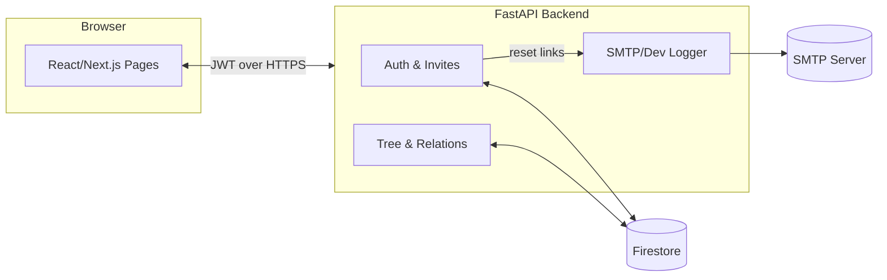

## Request Flow (Edge to Data)

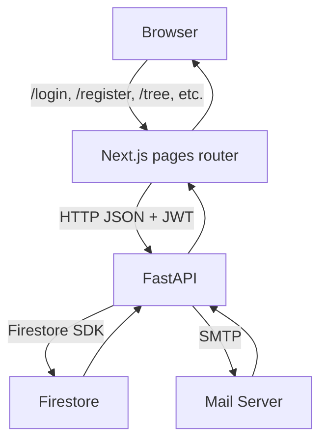

## Sequence Diagrams (Major Flows)

### Login

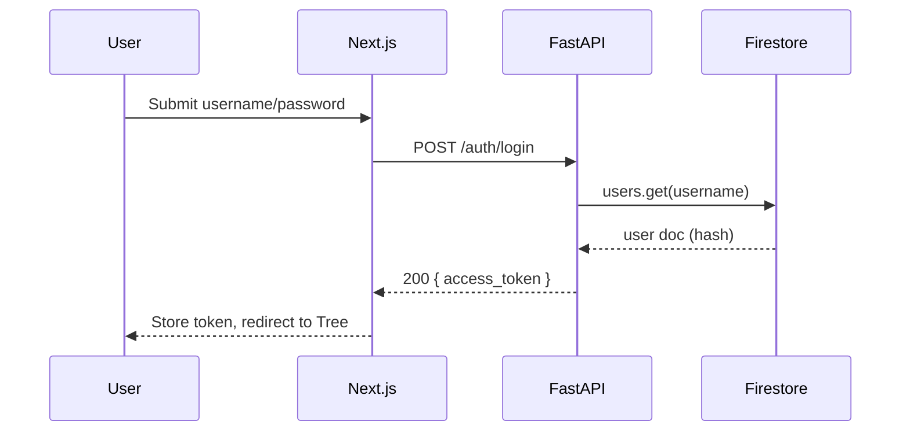

### Forgot Password

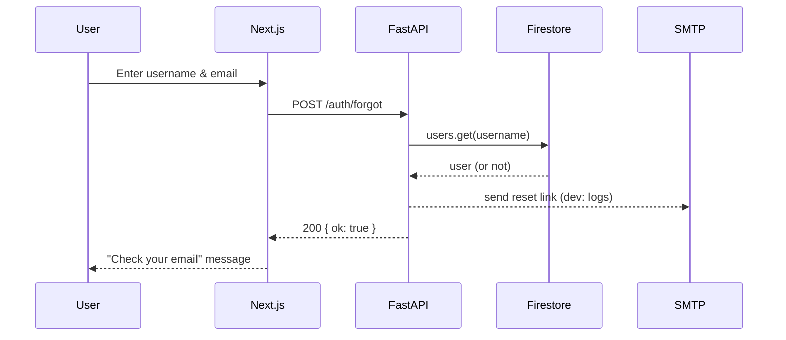

### Register (with Invite)

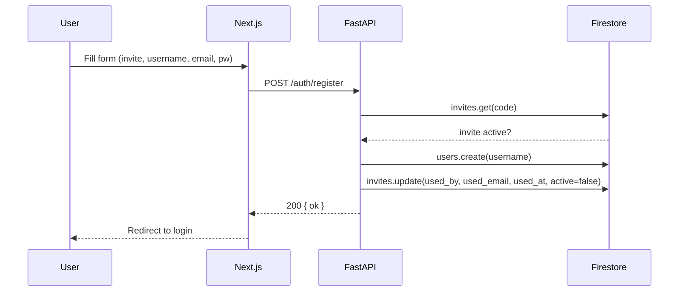

### Generate Invites

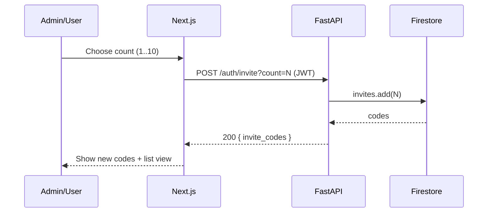

### Add Member

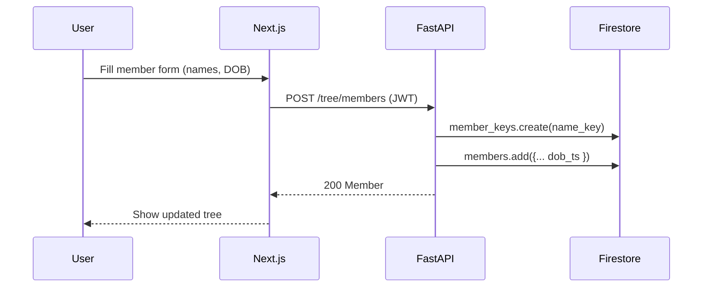

### Edit Member

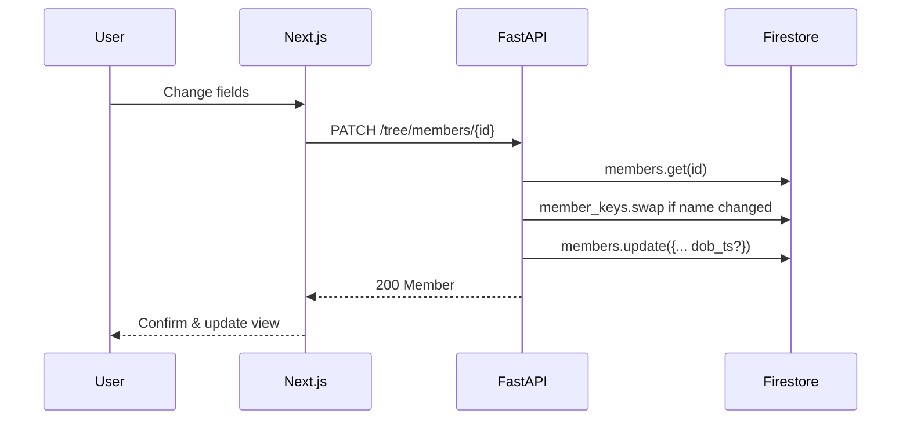

### View Member

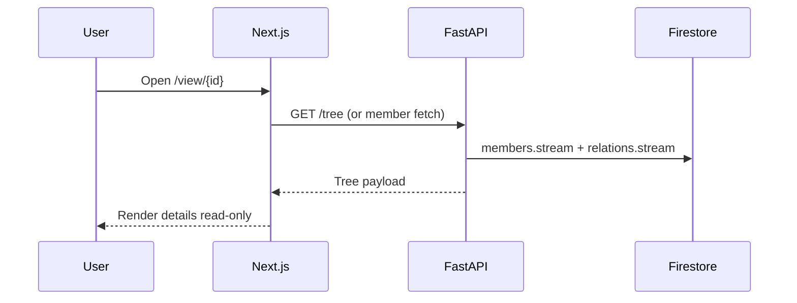

### Delete Member

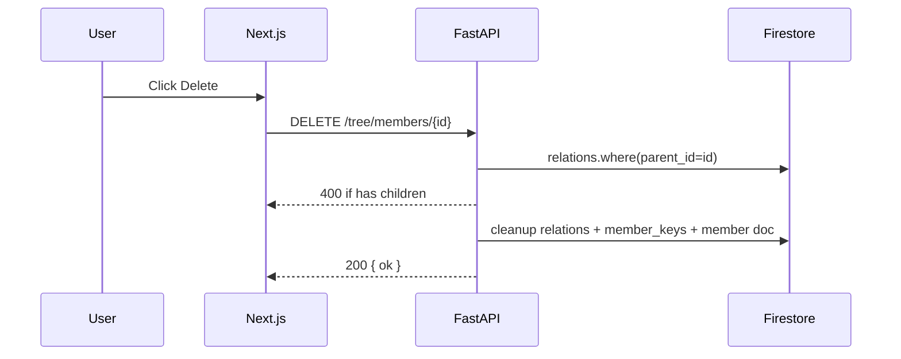

### Move

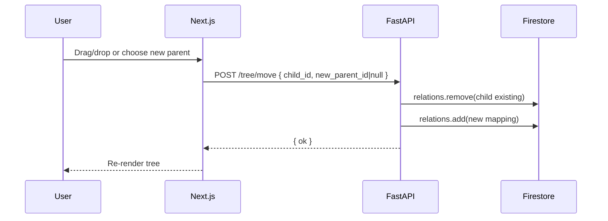

### Add/Unlink Spouse

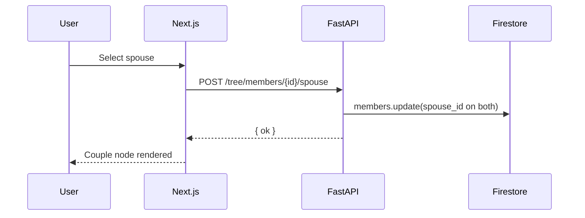

### Logout

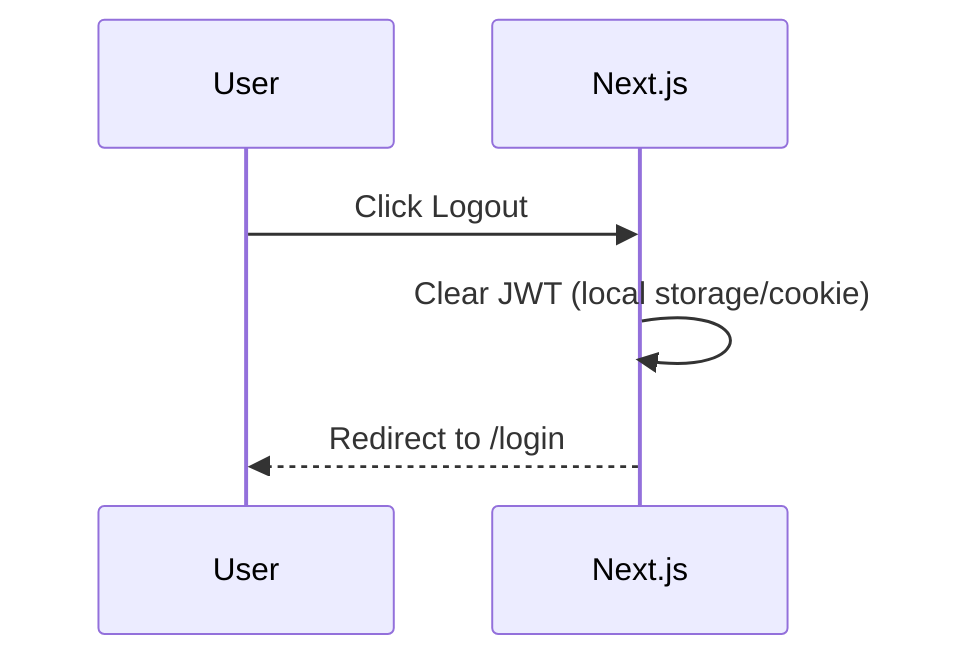

## Firestore Data Model

- `users` (by `username` as document ID)
  - `email`, `password_hash`, `created_at`, `invite_code_used`, `reset_token` (optional), etc.
- `invites` (invite codes)
  - `code`, `expires_at`, `used_by` (optional), `active`
- `members` (family members)
  - fields: first_name, middle_name, last_name, dob, birth_location, residence_location, email, phone, hobbies (array)
- `relations`
  - `child_id` -> `parent_id` mapping
- A view endpoint assembles the tree in the backend.

## Move Semantics

Moving a node under a new parent updates the `relations` mapping; subtree relationships remain intact.
